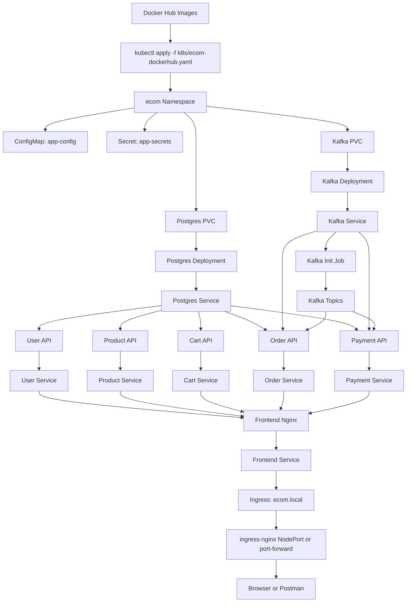
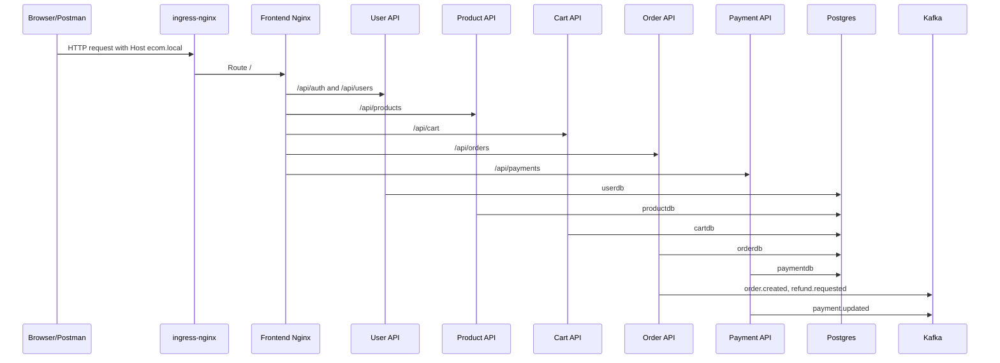

# Kubernetes Deployment Workflow

This workflow deploys the complete e-commerce stack to the local Minikube cluster using Docker Hub images.

## Apply Command

```bash
kubectl apply -f k8s/ecom-dockerhub.yaml
kubectl get pods -n ecom -w
```

## Workflow Diagram



## Request Flow



## Access Options

NodePort from WSL:

```bash
kubectl get svc -n ingress-nginx ingress-nginx-controller
curl -H 'Host: ecom.local' http://$(minikube ip):<NODE_PORT>/
```

Port-forward for Windows browser or Postman:

```bash
kubectl port-forward --address 0.0.0.0 -n ingress-nginx svc/ingress-nginx-controller 8088:80
```

Then call:

```text
http://127.0.0.1:8088
```

Use this header for API clients when calling by IP or localhost:

```text
Host: ecom.local
```
